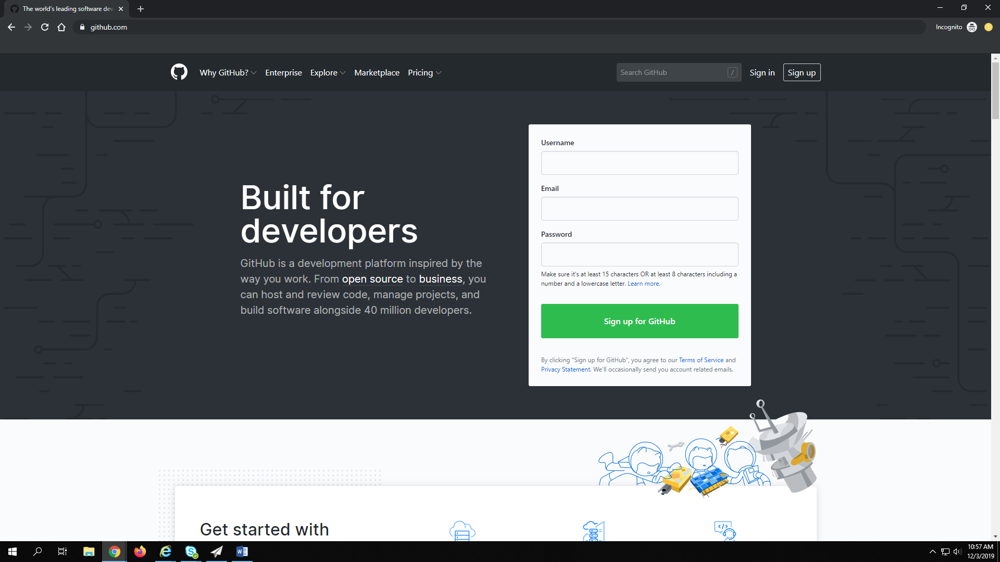
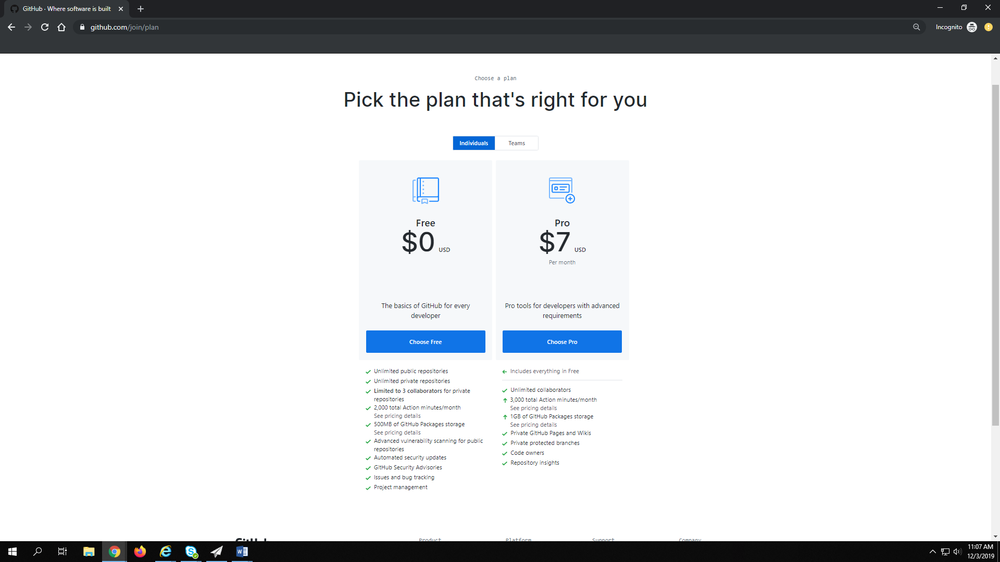
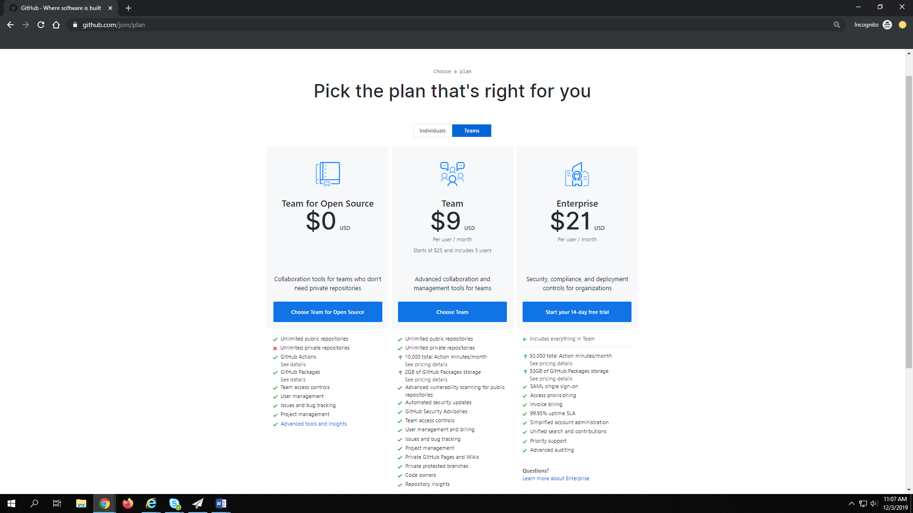
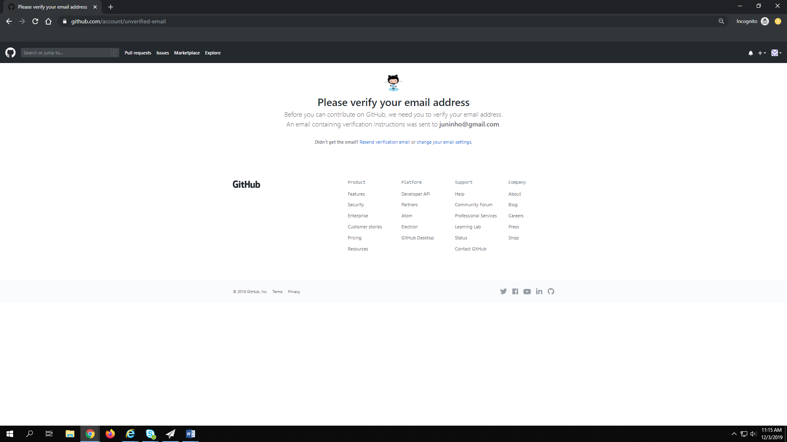

# How to Create a Github Account
---

This is a short tutorial on how to make a GitHub account. Assuming you have never even been on the website before, this tutorial will teach an absolute beginner how to make a GitHub account. [GitHub](https://en.wikipedia.org/wiki/GitHub) is a website that hosts software development version control using [Git](https://en.wikipedia.org/wiki/Git). Github is useful for programmers to host their code on the internet for others to collaborate on, share, or to grade for an assignment. This tutorial will help you to create a GitHub account for future use.

## Step 1: Navigating to the GitHub Website

In order to create a GitHub account, you must visit their website.  is the URL that will take you to the website.

## Step 2: Selecting a Username, Email, and Password

Once on the website, you will see an immediate prompt for creating an account. At this point, you will need to choose a username, email, and password for your account. Once this has been chosen, you must click on the, **"Sign up for GitHub"** button in that same area of the webpage.

## Step 3: Select a Plan

GitHub requires that you select a plan for whatever uses you plan to use GitHub for. There is a Free option that allows the user to use the basic functions of GitHub including unlimited private and public repositories. There exists a Pro option that is $7 a month but allows for ulimited collaborators (Free only allows 3 per private repositories) among other immense benefits. You should select the plan that is best suited for your uses. There are also options for team environments.

## Step 4: Complete Setup and Verify Email

Once this step is reached, the account is almost set up! Next, you must answer some questions about your motives for using GitHub and what experience you have with programming. You will also be prompted to write out your interests. Once complete, click **"Complete Setup"** and you will be prompted to verify your email. You will need to go to your email and find an email from GitHub and verify that you created the account. Once done, your account is all ready for use!

You will now be able to start repositories for any project you desire!

Thank you for following my tutorial! Thanks to Dale Musser for providing this course!

---

**Mason Adrales**

Information Technology
